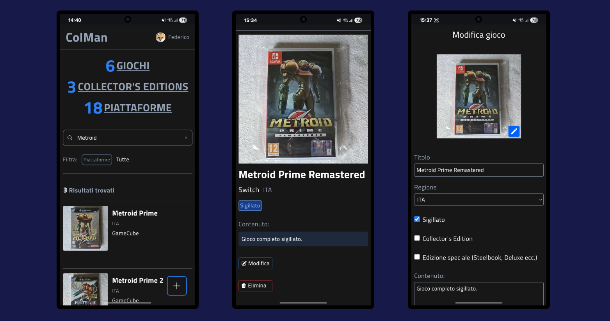

  <h1>Colman</h1>

Colman sta per "collection manager" ed è una web app full stack (React, Next.Js, Tailwind e Supabase) per dispositivi mobili per gestire la mia collezione di videogiochi in modo rapido. 

In questa prima versione ho mantenuto un design semplice (ispirato all'app mobile di eBay) con priorità alla funzionalità, ma non mancano transizioni css per dare più fluidità e i vari spinner di caricamento e indicatori per le richieste asincrone grazie a Next.Js, Suspense e useTransition di React. 
Le notifiche toast di avvenuta aggiunta/modifica/eliminazione sono gestite con la fantastica libreria React Hot Toast.

Con questa applicazione si possono inserire/modificare/eliminare nuovi giochi direttamente nel database di Supabase (PostgreSQL) prendendo le foto dalla galleria del telefono e compilando una "scheda prodotto" vera e propria con le informazioni sul gioco.

## Tecnologie usate

- **Next.Js**
- **Auth.js**
- **Supabase**
- **Tailwindcss**
- **React Hot Toast**

## Funzionalità

- L'intera app è accessibile solo tramite uno specifico account Google che deve corrispondere a quello inserito nel database (non è un'autenticazione vera e propria per ora!);
- Homepage con ricerca in tempo reale di giochi e filtro piattaforma;
- Notifiche toast di avvenuta aggiunta, modifica o eliminazione;
- Lista di tutti i videogiochi con paginazione e filtro piattaforma;
- Lista di tutte le collector's editions con paginazione e filtro piattaforma;
- Lista di tutte le piattaforme;
- Funzione di aggiunta giochi e piattaforme con i relativi dati (immagine, nome, regione, contenuti ecc.);
- Checkbox per giochi sigillati, edizioni speciali e collector's editions;
- Funzione di modifica delle schede di giochi e piattaforme;
- Funzione di eliminazione giochi e piattaforme;
- Funzione di modifica dell'immagine del gioco.
