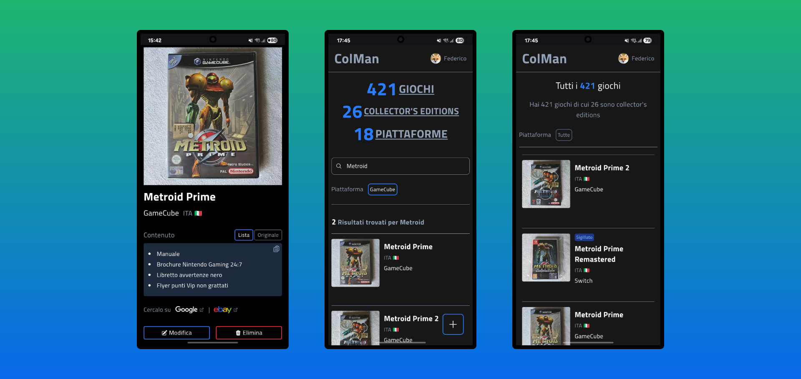

  <h1>ColMan</h1>

Colman sta per "Collection Manager" ed è una Single Page Application full-stack specifica per smartphone per gestire la mia collezione di videogiochi in modo rapido. 

Con questa applicazione si possono inserire/modificare/eliminare nuovi giochi e piattaforme direttamente nel database di Supabase (PostgreSQL) scattando la foto sul momento o prendendola dalla galleria del telefono e compilando una vera e propria "scheda prodotto" con le informazioni sul gioco o sulla piattaforma. 

Vedere le sezioni Funzionalità generali e Pagina gioco per una panoramica piú completa. 

In questa prima versione ho mantenuto un design semplice con priorità alla funzionalità e con transizioni/animazioni css per dare più fluidità, ma anche spinner di caricamento, skeleton loader e overlay durante il fetch dei dati e le server actions grazie a Next.Js, Suspense e useTransition di React. 

Le notifiche toast di avvenuta aggiunta/modifica/eliminazione sono gestite con la fantastica libreria React Hot Toast. 

Questo progetto è interamente fatto a mano da zero e non sono stati usati tools IA.

## Funzionalità generali

- Ricerca con filtro piattaforma e render in tempo reale delle card di preview dei giochi;
- Hero section con recap del numero totale di giochi, collector's editions e piattaforme totali;
- Spinner, overlay e skeleton loader durante i caricamenti, fetch dei dati e server actions di Next;
- Notifiche toast di avvenuta aggiunta, modifica o eliminazione giochi e piattaforme;
- Lista delle card di tutti i giochi con paginazione variabile e filtro piattaforma;
- Lista delle card di tutte le collector's editions con paginazione variabile e filtro piattaforma;
- Lista di tutte le piattaforme;
- Pagina di creazione giochi e piattaforme con i relativi dati (immagine, nome, regione, contenuti ecc.);
- Modifica dei dati dei giochi e dell'immagine;
- Modifica dei dati delle piattaforme;
- Eliminazione di giochi e piattaforme con modal di conferma custom;
- Checkbox per giochi sigillati, edizioni speciali e collector's editions;
- Inserimento automatico di un testo di defualt se viene selezionata la checkbox per gioco sigillato;
- Visualizzazione dinamica in tempo reale della lunghezza del testo inserito negli input e della lunghezza massima consentita dal relativo input.

## Pagina gioco

- Generazione automatica della lista dei contenuti del gioco basata sul testo scritto dall'utente;
- Buttons per visualizzazione lista contenuti del gioco o testo originale contenuti del gioco;
- Button animato di copia della lista preformattata dei contenuti del gioco;
- Link dinamici basati su titolo gioco e piattaforma per cercare informazioni sul gioco su Google o eBay in una nuova scheda;
- Badge di stile diverso per giochi sigillati, edizioni speciali e collector's editions;
- Button modifica e button elimina con modal custom di conferma eliminazione;
- Render di un overlay animato "Eliminazione..." durante la server action di eliminazione del gioco;
- Render dinamico delle emoji delle bandiere corrispondenti alla relativa regione del gioco.

## Tecnologie usate

- **Next.Js**
- **Tailwindcss**
- **Auth.js**
- **Supabase**
- **React Hot Toast**
- **Js-cookie**

> ⚠️ Quest'app è per uso personale, perciò è accessibile solo tramite uno specifico account.
